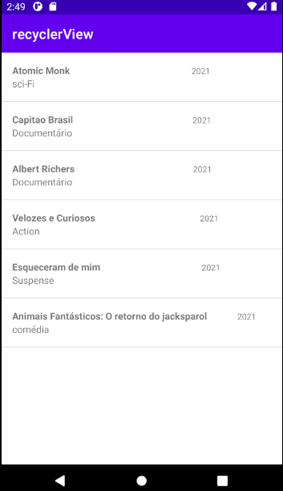

# recyclerView

<h1 align="center">
 
  
 
 
DjMaker
</h1>

Description

RecyclerView makes it easy to efficiently display large sets of data. You supply the data and define how each item looks, and the RecyclerView library dynamically creates the elements when they're needed.

  

[//]: # (Add your gifs/images here:)

  
  [//]: # 

## License

This project is licensed under the MIT License - see the [LICENSE](https://opensource.org/licenses/MIT) page for details.
